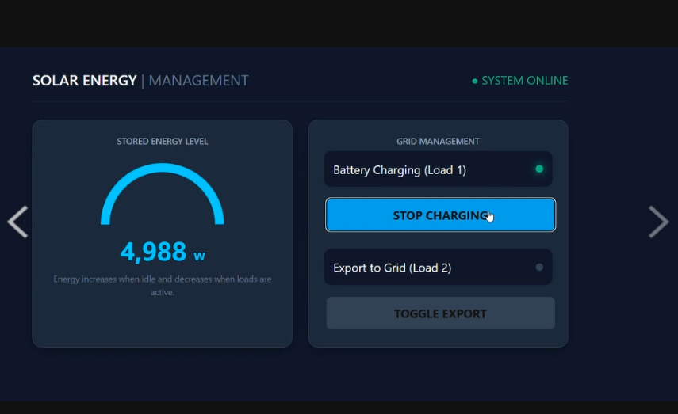

# Smart Solar Energy Storage System (SOLAR GEN-03)

* * *

## Group Information

| | |
|---|---|
| Group name | SOLAR GEN-03 |
| Member 1 | KANTANAT YUVAWANITCHAKORN — 67070504001 |
| Member 2 | NARUJ LIMNUNTHAPHISIT — 67070504004 |
| Member 3 | SIRAPHOP DACHSUJJA — 67070504012 |
| Course | INC272: MINI-PROJECT I FOR AUTOMATION ENGINEERING |

* * *

## Project Goal

This application is a smart energy management dashboard that simulates a solar energy storage system. It monitors real-time simulated solar intensity to accumulate "Stored Energy" and controls the dynamic depletion of this energy by toggling active system loads (Battery Charging and Grid Export).

* * *

## Simulator Features Used

- [x] LED — 4 channels, toggle on/off
- [ ] PSW — 4 push switches, read state
- [x] ADC — 4 analog channels, read sensor values
- [ ] PWM — 4 channels, control duty ratio

* * *

## Interface Features

### Monitoring Elements

| Element | What It Shows | Simulator Feature |
|---------|--------------|-------------------|
| Power Gauge | Current stored energy level capacity (0-5000W) | ADC ch.0 (Used to calculate charge rate) |
| Text Value | Real-time numerical energy value | ADC ch.0 |

### Control Elements

| Element | What It Does | Command Sent |
|---------|-------------|--------------|
| TOGGLE CHARGING Button | Turns on/off Battery Charging Load | `ledSet(0)` / `ledClr(0)` |
| TOGGLE EXPORT Button | Turns on/off Grid Export Load | `ledSet(1)` / `ledClr(1)` |

* * *

## How to Run

1. Start the mock hardware server:
   ```bash
   cd simulator/mock-hardware-server
   npm start

project-folder/
├── index.html      — main page containing UI layout and inline CSS styling
├── main.js         — application logic for energy calculation and simulator communication
└── README.md       — project documentation

## Known Limitations

- **Data Persistence:** The `storedEnergy` variable is maintained in the browser's volatile memory. If the page is refreshed, the accumulated energy resets to 0.
- **Fixed Load Rates:** The discharge rates are fixed at arbitrary values (20 and 30) for simulation purposes and do not represent real-world electrical load curves.


